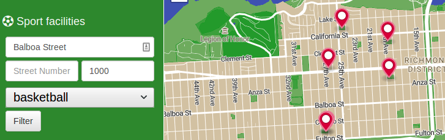
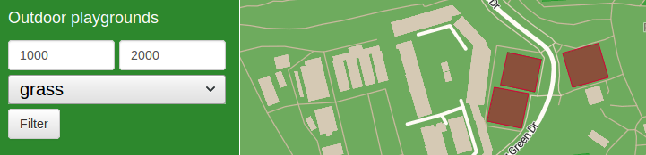
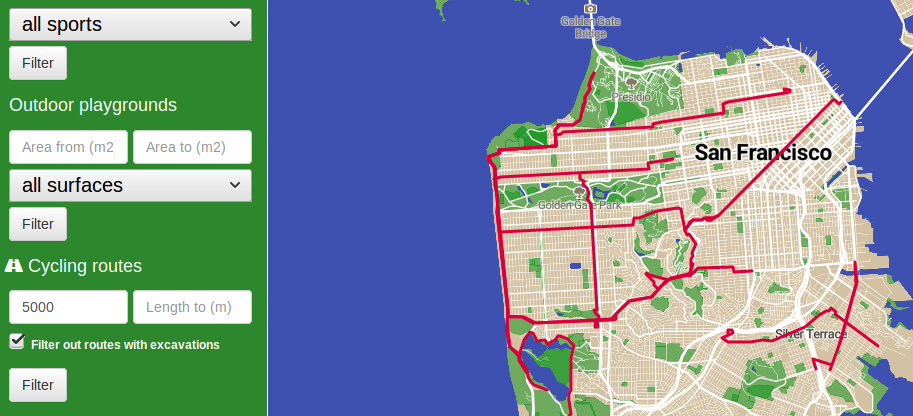

# SportTracker

Táto aplikácia zobrazuje športové objekty. Kľúčové funkcionality aplikácie:
- vyhľadanie športových objektov na základe vzdialenosti od zadanej adresy
- vyhľadanie športových objektov na základe vybraného športu
- vyhľadanie vonkajších ihrísk podľa zadaného povrchu
- vyhľadanie vonkajších ihrísk na základe plochy ihriska
- vyhľadanie cyklistických ciest na základe dĺžky
- vyhľadanie cyklistických ciest bez prebiehajúcich výkopových prác v ich blízkosti

# Architektúra aplikácie

# Backend

Aplikáciu som implementoval v jazyku Java s využitím aplikačného frameworku Spring Boot s embedded Tomcat serverom. Backendová časť využíva PostgreSQL driver pre komunikáciu s databázou, všetku komunikáciu s databázou zabezpečuje trieda implementujúca vzor repozitár. Výsledky poskytované repozitárom sú spracované triedou typu služba, ktorá požadované spracované výstupy poskytuje kontroléru pre jednotlivý REST endpoint, ktorý obdržal HTTP požiadavku.

# Frontend

Frontendová časť je realizovaná prostredníctvom frameworku thymeleaf a v ňom vytvorenej šablóny. Šablóna pozostáva z HTML obohateného o špeciálne výrazy frameworku thymeleaf, štýl šablóny je prispôsobený za pomoci CSS (Bootstrap, Custom), na zobrazenie mapy a objektov na nej je použitá javascriptová knižnica MapBox GL. Pre zobrazenie mapy využívam publikovaný custom štýl vytvorený pomocou MapBox štúdia, na ktorý sa odkazujem v html šablóne s využitím knižnice MapBox GL. Thymeleaf šablóna pristupuje k dynamickému obsahu prostredníctvom špeciálneho dátového objektu model, ktorý napĺňa kontrolér.

# Data

## Vytvorenie databázy

1. Stiahnutie PostgreSQL databázy s nainštalovaním PostGIS rozšírenia.
2. Vytvoril som databázu gis a aktivoval pre ňu rozšírenie postgis.
3. Pre zisk dát som použil nástroj OpenStreetMap, v ktorom som nastavil viewport na oblasť môjho záujmu a teda mesta San Francisco, následne som dal dáta z oblasti exportovať a stiahnuť
4. Stiahnuté dáta z OpenStreetMap boli vo formáte XML, stiahol a nainštaloval som nástroj osm2pgsql, ktorý z XML dát vytvoril príslušné tabuľky v mnou vytvorenej databáze gis

## Výber a import datasetu

Rozhodol som sa pre dataset ''SF Large Utility Excavation Permits''. Tento dataset obsahuje geo-dáta pre povolenia výkopových prác v meste San Francisco. Celkovo obsahuje 3504 takýchto záznamov. Dataset som stiahol vo formáte CSV, v ktorom zaberal 1.6MB.
Stiahnutý dataset vo formáte CSV som ešte upravil vymazaním atribútov, ktoré som pre svoju prácu nepotreboval. Takto upravené CSV som skopíroval do novo vytvorenej tabuľky ''excavations'' vrámci databázy gis. Pre túto tabuľku som pridal jeden stĺpec ''way'', ktorý je typu geometry a je dynamicky vytvorený z hodnôt latitude a longitude v príslušnom riadku. Týmto som dostal stĺpec konzistentný s geometrickým stĺpcom evidovaným v ostatných tabuľkách . 

## SQL dopyty a optimalizácia

### Dáta pre filtre
Pre selekty vo filter sekciách pre 1. a 2. scenár, ktoré listujú dostupné športy a povrchy ihrísk som vytvoril 2 samostatné tabuľky: `sports` a `surfaces`, pre optimalizáciu získavania týchto dát.

### Dáta pre mapu

Každý z 3 spomenutých scenárov má vlastný SQL dopyt, ktorý realizuje zisk potrebných dát. Každý z týchto dopytov som sa snažil čo najlepšie optimalizovať. Jednotlivé optimalizačné kroky sú krátko spomenuté tu, pre podrobnejší opis aj s uvedenými hodnotami Total Costov pred a po optimalizácii dopytov pozri [tu](Dokumentacia/PDT_project.pdf):

- GIN index `polygon_sports` na stĺpci `string_to_array(sport, ';'::text)` v tabuľke `planet_osm_polygon`
- GIN index `point_sports` na stĺpci `string_to_array(sport, ';'::text)` v tabuľke `planet_osm_point`
- GIST index `polygon_geography` na stĺpci `(st_transform(st_centroid(way), 4326))::geography` v tabuľke `planet_osm_polygon`
- GIST index `point_geography` na stĺpci `(st_transform(way, 4326))::geography` v tabuľke `planet_osm_point`
- multicolumn BTree index `polygon_leisure_area_surface` na stĺpcoch `leisure`, `st_area((st_transform(way, 4326))::geography)`, `surface` v tabuľke `planet_osm_polygon`
- BTree index `line_route` na stĺpci `route` v tabuľke `planet_osm_line`
- BTree index `line_length` na stĺpci `st_length(st_transform(way, 4326))::geography` v tabuľke `planet_osm_line`
- multicolumn BTree index `excavations_status_start_end` na stĺpcoch `permit_start_date::date`, `permit_end_date::date` v tabuľke `excavations`

# Scenáre

Aplikácia pozostáva z 3 oddelených scenárov, z ktorých každý má vlastnú sekciu filtrov v ľavom paneli.

## Zobrazenie športovísk

Prvý scenár je určený pre zobrazenie športových objektov na mape podľa zadaných preferencií týkajúcich sa polohy a športu zadaných v ľavom paneli. Adresa a vzdialenosť (udávaná v metroch) udávajú polohu a vzdialenosť od tejto polohy, vrámci ktorej budú zobrazené existujúce športové objekty. Pre preklad adresy na súradnice je použité Google API. Tento scenár bez preferencií je použitý ako defaultný.



## Zobrazenie vonkajších ihrísk

Druhý scenár sa venuje zobrazeniu vonkajších ihrísk. Takisto mu je venovaná samostatná filtrovacia sekcia v ľavom paneli aplikácie. V tejto sekcii je možné špecifikovať typ povrchu ihriska ako aj jeho plochu. Môžme teda zobrazovať vonkajšie ihriská, ktoré vyfiltrujeme podľa požadovaného povrchu a plochy.



## Zobrazenie cyklistických ciest

V treťom scenári je realizované zobrazenie cyklistických ciest. Tomuto scenáru je opäť ako v predošlých dvoch prípadoch venovaná filtrovacia sekcia v ľavom paneli aplikácie. V prípade cyklistických ciest sme schopní filtrovať na základe dĺžky cyklistickej cesty, či už dolným alebo horným limitom. Tento scenár využíva externý dataset importovaný do databázy, pre zabezpečenie dodatočnej možnosti filtrovania ciest, v blízkosti ktorých môžu prebiehať výkopové práce. Tento filter je možné zapnúť/vypnúť pomocou checkboxu s legendou, ktorá vysvetluje jeho vplyv.



# Api

## Požiadavky

**Vyhľadanie športovísk podľa vzdialenosti a športu**

`GET /facilities?streetName=Cabrillo+Street&streetNumber=&distance=300&sport=tennis`

**Vyhľadanie vonkajších ihrísk podľa plochy a povrchu**

`GET /playgrounds?areaFrom=500&areaTo=2000&surface=grass`

**Vyhľadanie cyklistických ciest podľa dĺžky a bez v blízkosti prebiehajúcich výkopových prác**

`GET /cycling-routes?lengthFrom=5000&lengthTo=7000&filterExcavations=true`

## Odpoveď

Príklad športového objektu vráteného v odpovedi pre 1. scenár.

```
{
    "type": "Feature",
    "geometry": {
        "type": "Point",
        "coordinates": [
            -122.487244937468,
            37.7733447628416
        ]
    },
    "properties": {
        "leisure": "pitch",
        "sports": "[tennis]",
        "marker-color": "#D8003A",
        "marker-size": "medium",
        "marker-symbol": "circle"
    }
}
